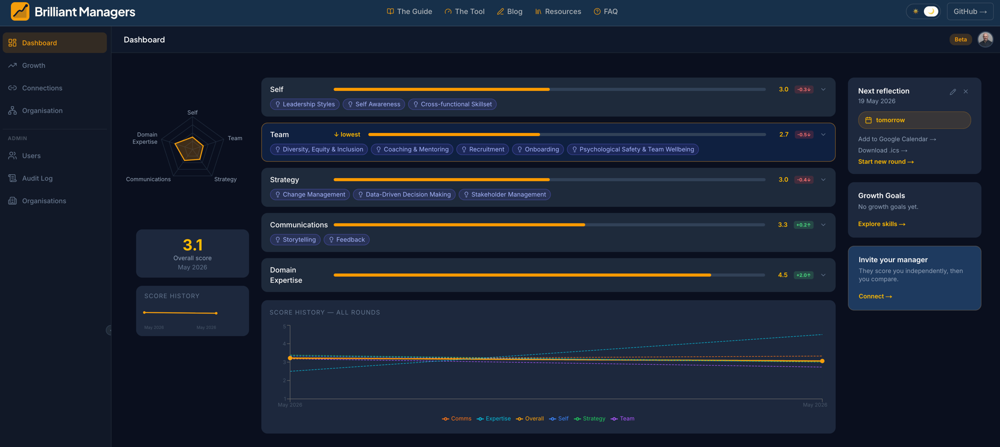

# Brilliant Managers

Brilliant Managers is a management effectiveness tool for engineering managers. It tracks scores across five pillars — Self, Team, Strategy, Communications, and Domain Expertise — supports 360-degree feedback by connecting with your manager, and visualises progress across multiple reflection rounds.



## Stack

| Layer | Technology |
|---|---|
| Framework | Next.js 16 (App Router), React 19, TypeScript |
| Auth & database | Supabase (Postgres with Row Level Security) |
| Styling | Tailwind CSS v4, Radix UI, shadcn/ui |
| Testing | Vitest + Testing Library |
| Deployment | Netlify |

## Getting started

### Prerequisites

- Node.js 18+
- A Supabase project (free tier is fine)

### Environment

Create `.env.local` in the project root:

```
NEXT_PUBLIC_SUPABASE_URL=
NEXT_PUBLIC_SUPABASE_ANON_KEY=
SUPABASE_SERVICE_ROLE_KEY=
ANTHROPIC_API_KEY=
MAILGUN_API_KEY=
MAILGUN_BASE_URL=
MAILGUN_SENDING_KEY=
```

`NEXT_PUBLIC_*` values come from your Supabase project's API settings. `SUPABASE_SERVICE_ROLE_KEY` is the service role secret — never expose it client-side. `ANTHROPIC_API_KEY` powers AI-assisted features. Mailgun keys are for transactional email.

### Run locally

```bash
npm install
npm run dev     # http://localhost:3000
npm test        # run test suite
```

## Contributing

1. Fork the repo and create a branch: `git checkout -b my-change`
2. Make your changes and write tests for any new behaviour
3. Run `npm test` — all tests must pass
4. Open a pull request against `master`

New tables in Supabase must have Row Level Security enabled with explicit policies for every operation. See the [RLS rules in CLAUDE.md](CLAUDE.md#supabase--database-rules) for the full checklist.

## Roadmap

Outstanding features and known gaps:

- **Dashboard — pillar drill-down**: Tapping a pillar should open a deep-dive view (score history graph per section, skill breakdown) with a clear route back to the dashboard. We had per-section graphs previously; the goal is to bring that back as a drill-down rather than a separate page.
- **Score history chart — hover/tooltip**: The all-rounds chart on the dashboard should show values on hover so users can read exact scores without guessing from the axis.
- **Radar chart — hover/tooltip**: Hovering a vertex on the radar should surface the pillar name and score.
- **Consolidate Connections → Organisation**: Remove the separate Connections section. The Organisation page should be the single place for team/peer relationships, with an invite flow accessible from the top of that page.
- **Fix Organisations**: The multi-org flow has known issues that need investigation and fixing.
- **Growth section**: The current Growth section is a placeholder — needs a full build-out (goals, skill gaps, development plans, progress tracking).
- **Toast notifications**: Surface action confirmations and errors as toast notifications — likely [Sonner via shadcn/ui](https://ui.shadcn.com/docs/components/radix/sonner).
- **Reflections page**: A dedicated page showing upcoming and past reflection schedules. Round creation should default the title to `QX YYYY` (based on the current quarter) with the option to edit before saving.

## Delivered

Features that have shipped:

- **Invite unregistered users** *(May 2026)*: Inviting a connection whose email has no account now sends them an invite email with a registration link. Their connection activates automatically when they verify their OTP — no manual coordination required.
- **User feedback** *(May 2026)*: Sleekplan feedback widget integrated into all authenticated app pages. Users can submit ideas, view the roadmap, and report bugs without leaving the product.

## License

MIT
